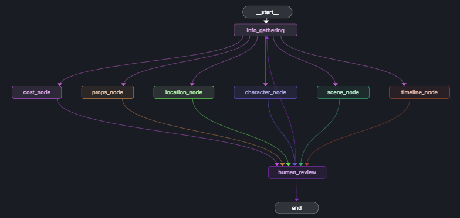

# Workflow

# Execution Order
### Phase 1: Data Extraction
1. pdf_utils.py (if PDF) → Extract text
2. info_gathering_agent.py → Parse into scenes/characters/locations

### Phase 2: Parallel Analysis
All these run simultaneously using the same raw data:
* character_analysis_agent.py
* cost_analysis_agent.py  
* location_analysis_agent.py
* props_analysis_agent.py
* scene_analysis_agent.py
* timeline_analysis_agent.py

### Phase 3: Human Review
workflow.py → Waits for human feedback → May re-run specific agents

### Phase 4: Output
data_transformer.py → Converts to final JSON → api.py returns to user

### Summary all phase
**Input Flow**:
Script File → PDF Utils → Info Gathering → Raw Data

**Analysis Flow**:
Raw Data → 6 Analysis Agents (parallel) → Individual Results

**Workflow Flow**:
Workflow Manager → Coordinates everything → Handles human feedback

**Output Flow**:
All Results → Data Transformer → Enhanced JSON → API Response

---
### Endpoints:

* POST
  * **/analyze-script-file**: Upload and analyze PDF/text files
* POST
  * **/analyze-script**: Analyze text content directly
* POST
  * **/submit-feedback**: Handle human feedback and revisions
* GET
  * **/workflow-status/{thread_id}**: Get analysis progress
* GET
  * **/scenes/{thread_id}/{scene_id}**: Get specific scene data
* GET
  * **/departments/{thread_id}/{department}**: Get department-specific data
---
### Agents vs Graph function
* **Agents** = The "brain" (domain expertise and analysis)
* **Graph** = The "conductor" (orchestration and state management)

|Aspect|Agents|Graph|
|------|------|-----|
|Focus|Domain analysis|Workflow management|
|Input|Raw Script Data|Workflow state|
|Ouput|Analysis Results|State Updates|
|Dependencies|AI models,Domain Logic|Agents,State Management|
|Error Handling|Domain Specific fallbacks|Workflow-level recovery|
|State|Stateless|Stateful|
|Reusability|Highly reusable|Workflow-specific|